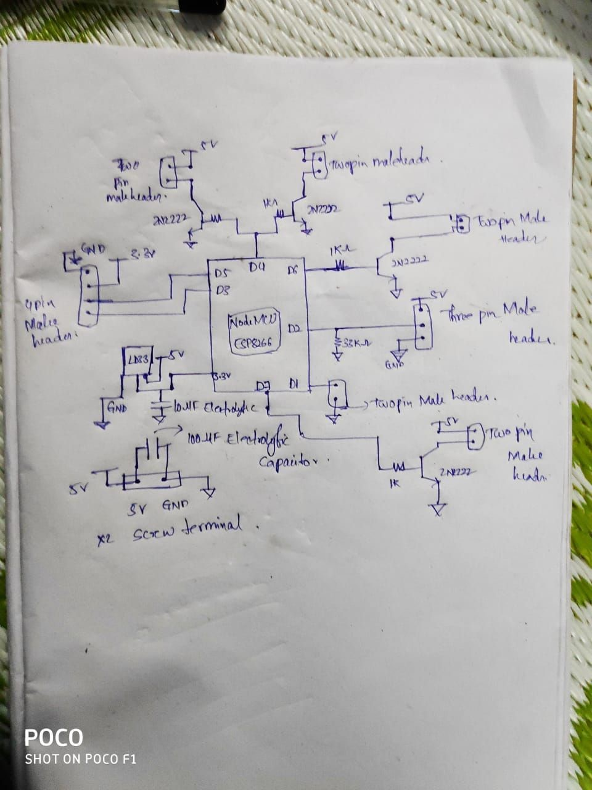

# BLITZKREIG

**A TECHNITES PROJECT**

Panchami Kamath         16EE121

Mayur Choudhari        16EC156

Yashwanth G                 16EC154

Aditya Manjunath        17EC104

Rahasya Barkur                17EC138

Anirudh Aatresh        17EC106

Nikesh Dhruw                 17EE229

## Introduction

Blitzkrieg is a game that is organized during the Engineer fest of National Institute of Technology Karnataka.

It is a game played that is similar to the famous game, &quot;Lazer Tag&quot;.

## How it works

Blitzkrieg has been built based on the concept of a laser tag system. It is one of the few projects of Technites which involves audience participation.

**The game:** It requires 8 participants. They are divided into two teams of 4. Each​ participant is provided with a jacket (a training bib) installed with infrared receivers and a gun which shoots/emits infrared light. Initially, each player will be provided with a certain amount of health power (HP) and ammo before the start of the game. The two of these quantities are displayed on an OLED screen attached to the gun on the side. The goal of the game is to shoot and bring down the opponent team within a certain amount of time.

When a player shoots, he loses his ammo and when a player gets shot he loses HP. There is no friendly fire. Once a player loses either all his ammo or HP or both, he/she is out of the game. The winner of the two teams is decided by the number of players remaining, or based on HP and ammo left.

**Technical Aspect:** ​ ​Each jacket consists of 6 TSOP infrared receivers connected in parallel to each other(Note that each TSOP has three pins: Vcc, Ground, Output). The ends of one of the TSOPs is connected to the PCB which is placed inside the gun.  The PCB consists of a NodeMCU (to control the working of the circuit), capacitors, resistors, transistors, voltage regulators, IR LED, buzzer, battery, etc as mentioned above.

Now, when a player presses the trigger of the gun, the IR LED connected to the circuit and placed at the tip of the gun&#39;s barrel emits a pulse which when falls on any of the TSOPs of the opponent team player, tends to reduce the HP of the said player. Also it reduces the ammo of the player who fires.

The working of one complete circuit (gun and jacket) is controlled by a NodeMCU which is powered by a battery/power bank. The code for its working has been written in Arduino IDE (Code is a .ino file). Please check and install all the necessary libraries before running the code. The link to the code has been given below.

**Link:**

https://github.com/saikamalkola/Blitzkrieg/blob/master/rx\_tx\_raw/rx\_tx\_raw.ino

[Please note that the code can be changed as per convenience]

**Components Required**

- Node-MCU
- IR-LEDs
- TSOPs
- Collision switch
- Lasers
- Buzzers
- Transistors
- OLEDs
- Voltage regulators
- PCB boards
- LED&#39;s
- Resistors and capacitors

Different components such as the trigger, LED&#39;s, voltage regulators, etc have been connected to different digital and analog pins on the NodeMCU.

A brief description of the function of each component has been given below.

1) IR LED: Emits IR when trigger is pressed.

2) Voltage Regulator: An LD33 regulator has been used to limit the working voltage to       3.3V.

3) Transistors: BC107 or similar transistors have been used to act as a switch.

4) Capacitors: Used as filters.

5) Resistors: To limit current.

Code has been written in such a way that for different teams, the duration of the ON time of the IR pulse is different so that it avoids friendly fire.

Other components such as buzzers, red LEDs and lasers can be added to the circuit if you wish to make the game more interesting.

1) Buzzers: Can be used as an indicator when a player is shot.
2) Red LEDs: Can be used an indication when one fires.
3) Lasers: Can be used in guns as a trajectory indicator.

## Steps involved in making it

### Jacket

1. Make 6 slits (of the size of a TSOP) in the jacket such that they are evenly distributed all over. Preferably, 2 on the left, 2 on the right and 2 at the back.
2. Place the TSOPs in those positions. Measure the distance between the TSOPs.
3. According to the measured distances, make use of ribbon cables(group of 3) to connect all the TSOPs in parallel.
4. From one of the TSOPs(Preferably the one on the side), connect a ribbon cable so that its other end(which is connected to a 3 pin JST connector) can be connected to the gun later.
5. Make 8 such jackets.
6. Test connectivity using a multimeter and make sure all of them are functioning properly.

### Gun

1. On paper, draw the schematic of the entire circuit(including NodeMCU, IR LEDs etc). The schematic has been given below for reference.
   
2. According to the schematic, design the entire circuit on [https://easyeda.com](https://easyeda.com/)/ or any other PCB designing website which you prefer. Make necessary changes in the circuit if required.
3. To make the PCBs, use appropriate sized generic copper clad boards. Get a printed copy of the circuit on a glossy paper. Place this face down on the copper board, apply heat and pressure(use iron box) for a few minutes such that the circuit gets imprinted on the copper board. When these boards are dipped in ferric chloride solution, the tracks remain whereas extra copper gets removed, thus giving you the required circuit.
4. Make sure you perform step 3 properly so that you get the complete circuit without any discontinuities in between.
5. Now start soldering the components onto the PCB according to the circuit you designed. Instead of directly soldering components onto the board, make use of male headers wherever possible as they are more convenient to connect and disconnect when required.
6. If possible solder each and every pin of the NodeMCU to the board. Make sure there are no discontinuities using a multimeter.
7. Take necessary precaution while soldering so that you don&#39;t destroy components or hurt yourself in the process.
8. Whenever you solder wires or component leads, use shrink tubes beforehand to cover up the soldered ends ( avoids shorting of the circuit).
9. When the PCB  is complete, test the circuit by uploading the code onto the NodeMCU. Use a pair of guns with different team IDs in the code to check if health and ammo are decreasing(Please keep making sure that the circuit works).
10. Once you are done testing, glue the boards onto the inside of the gun using a hot glue gun(make space for the board in the gun by cutting extra plastic off using pliers). Make necessary modifications to the gun so that all the peripherals can be attached to the board before the gun is glued and closed completely. The IR LED should be positioned at the tip of the barrel and glued. 
11. Attach the OLED screen to one of the outer sides of the gun.

Once the jacket is connected to the gun and the NodeMCU is powered by connecting the battery, you are all good to go.

## Problems faced

1. PCB PREPARATION
  - Accurately printing tracks on all PCB&#39;s is a tedious task as there are unwanted situations of either tracks getting overlapped on each other or getting printed out of bounds of the board or even left out.
  - Drilling holes on the tracks for components to be soldered is also one of the problems, as there is easily a chance of drilling a hole on the wrong track.
  - PCB copper tracks might get oxidised within no time.
2. Soldering
  - While soldering components to connectors or to the board there is a high possibility of soldering the wrong pin or shorting with the next pin.
  - Polarity of the connectors are usually ignored while soldering.
  - Even polarity of the components soldered directly on the board have a chance of getting interchanged and this might burn all the components on the board.
3. NodeMCU
  - Mistake of not including libraries or inclusion of wrong libraries and uploading the code.
  - Uploading the wrong code.
  - NodeMCU requires 3.3V supply.
4. PCB&#39;s loosing continuity due to improper soldering.
5. Components along with the board are too large to be fit into the gun.

## Troubleshooting

1. If none of the components are working or only some of them are powered up.Using multimeter, continuity of the board can be checked.

- We can also check if all the components are getting powered up.
- We can check if the code of a particular components has a problem by considering only a part of program corresponding to that particular component and commenting all other sections.

2. IRLED&#39;s can be checked using phone cameras.
3. If any of the component such as IRLED ,TSOP&#39;s, buzzers, lasers , LED&#39;s or OLED&#39;s are not functional, check their polarities and the connector polarities and how they have been soldered to the board.

4. If NodeMCU isn&#39;t powering up make sure whether voltage regulator is providing enough power.

**Pictures and Videos of this project can be found here:**

https://drive.google.com/open?id=1-FFkvzxaugJHXC4dZatgF9QPzLP5wKGH
